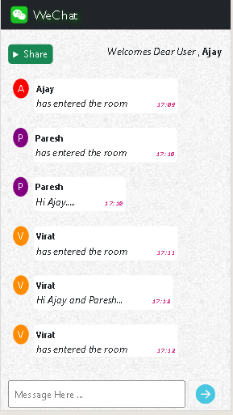
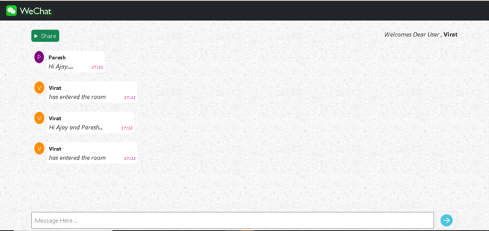

# WeChat Application using Flask-socketio in Python.

## Description of Web sites 

Your chat application focuses solely on messaging, providing a platform for users to send and receive text messages. It supports one-on-one conversations and group chats, allowing users to communicate in real-time.

## Image Preview 

---

